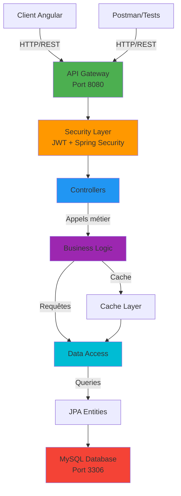
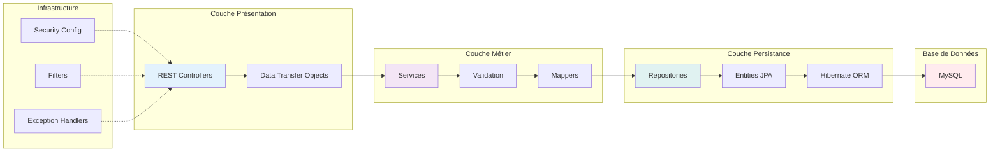
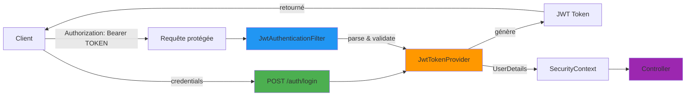
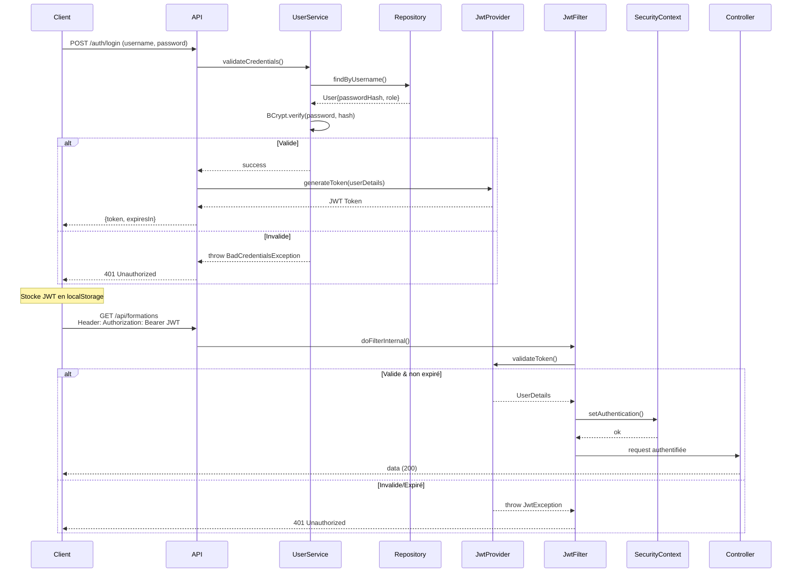

# Wiki Backend - LEYDYMEN Academy

## Table des matières
1. [Vue d'ensemble](#vue-densemble)
2. [Architecture](#architecture)
3. [Stack Technique](#stack-technique)
4. [Dépendances](#dépendances)
5. [Structure du Projet](#structure-du-projet)
6. [Modules Expliqués](#modules-expliqués)
7. [Patterns et Design](#patterns-et-design)
8. [Sécurité](#sécurité)
9. [API Endpoints](#api-endpoints)
10. [Testing](#testing)

---

## Vue d'ensemble

LEYDYMEN Academy Backend est une API REST construite avec **Spring Boot 4.1.0** pour gérer une plateforme complète de formation en ligne. L'application permet de gérer les formations, les utilisateurs, les inscriptions et le suivi de la progression des étudiants.

### Objectifs principaux
- Fournir une API RESTful sécurisée et scalable
- Gérer l'authentification via JWT
- Permettre CRUD complet sur les formations et utilisateurs
- Tracker la progression des étudiants
- Générer des statistiques détaillées
- Documenter via Swagger/OpenAPI

---

## Architecture

### Diagramme d'architecture global



### Architecture en couches



---

## Stack Technique

| Composant | Version | Justification |
|-----------|---------|---------------|
| **Spring Boot** | 4.1.0 | Framework web moderne avec auto-configuration |
| **Java** | 21 | LTS récent avec virtual threads et records |
| **Maven** | 3.9.6+ | Build tool standardisé Java (via wrapper) |
| **MySQL** | 8.0 | Base de données relationnelle robuste et performante |
| **Hibernate** | 6.x | ORM complet pour abstraction base de données |
| **Spring Security** | 6.x | Gestion de la sécurité et authentification |
| **JWT (JJWT)** | 0.12.6 | Tokens pour authentification stateless |
| **Lombok** | 1.18.42 | Réduction du boilerplate code (getters/setters) |
| **SpringDoc OpenAPI** | 2.7.0 | Documentation auto-générée Swagger/OpenAPI |
| **JUnit 5** | (Spring Boot) | Framework de testing modern |
| **Mockito** | (Spring Boot) | Mocking pour tests unitaires |

---

## Dépendances

### 1. Spring Boot Starters (fondation)

```xml
<!-- Spring Boot Web: Serveur Tomcat + Spring MVC -->
<dependency>
    <groupId>org.springframework.boot</groupId>
    <artifactId>spring-boot-starter-web</artifactId>
</dependency>
```
**Objectif**: Crée un serveur REST avec Tomcat embarqué, Spring MVC pour les contrôleurs, et Jackson pour la sérialisation JSON.

```xml
<!-- Spring Boot JPA: Hibernate + Spring Data -->
<dependency>
    <groupId>org.springframework.boot</groupId>
    <artifactId>spring-boot-starter-data-jpa</artifactId>
</dependency>
```
**Objectif**: Fournit l'ORM Hibernate et les repositories pour abstraire les requêtes SQL.

```xml
<!-- Spring Security: Authentification & Autorisation -->
<dependency>
    <groupId>org.springframework.boot</groupId>
    <artifactId>spring-boot-starter-security</artifactId>
</dependency>
```
**Objectif**: Gère l'authentification (login), autorisation (roles), et la chaîne de filtres de sécurité.

```xml
<!-- Validation: Bean Validation avec Jakarta -->
<dependency>
    <groupId>org.springframework.boot</groupId>
    <artifactId>spring-boot-starter-validation</artifactId>
</dependency>
```
**Objectif**: Valide les entités via annotations (@NotNull, @Email, etc.) et custom validators.

```xml
<!-- Actuator: Health checks & métriques -->
<dependency>
    <groupId>org.springframework.boot</groupId>
    <artifactId>spring-boot-starter-actuator</artifactId>
</dependency>
```
**Objectif**: Expose des endpoints pour monitoring (health, metrics, info).

### 2. Base de données & ORM

```xml
<!-- MySQL Driver -->
<dependency>
    <groupId>com.mysql</groupId>
    <artifactId>mysql-connector-j</artifactId>
    <scope>runtime</scope>
</dependency>
```
**Objectif**: Driver JDBC pour MySQL. Scope runtime car Maven le charge au démarrage.

```xml
<!-- H2 Database (Tests) -->
<dependency>
    <groupId>com.h2database</groupId>
    <artifactId>h2</artifactId>
    <scope>runtime</scope>
</dependency>
```
**Objectif**: DB en mémoire pour tests rapides sans dépendre de MySQL.

### 3. Authentification JWT

```xml
<!-- JJWT API -->
<dependency>
    <groupId>io.jsonwebtoken</groupId>
    <artifactId>jjwt-api</artifactId>
    <version>0.12.6</version>
</dependency>
<!-- JJWT Implementation -->
<dependency>
    <groupId>io.jsonwebtoken</groupId>
    <artifactId>jjwt-impl</artifactId>
    <version>0.12.6</version>
    <scope>runtime</scope>
</dependency>
<!-- JJWT Jackson (sérialisation) -->
<dependency>
    <groupId>io.jsonwebtoken</groupId>
    <artifactId>jjwt-jackson</artifactId>
    <version>0.12.6</version>
    <scope>runtime</scope>
</dependency>
```
**Objectif**: Crée et valide les tokens JWT pour l'authentification stateless. Séparation API/impl pour flexibilité.

### 4. Utilitaires de développement

```xml
<!-- Lombok: Génération de code -->
<dependency>
    <groupId>org.projectlombok</groupId>
    <artifactId>lombok</artifactId>
    <version>1.18.42</version>
    <scope>provided</scope>
</dependency>
```
**Objectif**: Via annotations (@Data, @AllArgsConstructor), génère getters/setters/equals/hashCode/toString. Réduit le boilerplate.

```xml
<!-- SpringDoc OpenAPI/Swagger -->
<dependency>
    <groupId>org.springdoc</groupId>
    <artifactId>springdoc-openapi-starter-webmvc-ui</artifactId>
    <version>2.7.0</version>
</dependency>
```
**Objectif**: Génère documentation Swagger auto à partir des contrôleurs. Accessible via /swagger-ui.html.

```xml
<!-- Apache Commons Lang -->
<dependency>
    <groupId>org.apache.commons</groupId>
    <artifactId>commons-lang3</artifactId>
</dependency>
```
**Objectif**: Utilitaires pour strings, arrays, etc. (ex: StringUtils.isBlank()).

### 5. Testing

```xml
<!-- Spring Boot Test (JUnit 5, Mockito, MockMvc) -->
<dependency>
    <groupId>org.springframework.boot</groupId>
    <artifactId>spring-boot-starter-test</artifactId>
    <scope>test</scope>
</dependency>
```
**Objectif**: Bundle complet: JUnit 5, Mockito, AssertJ, MockMvc pour tests unitaires et d'intégration.

```xml
<!-- Spring Security Test -->
<dependency>
    <groupId>org.springframework.security</groupId>
    <artifactId>spring-security-test</artifactId>
    <scope>test</scope>
</dependency>
```
**Objectif**: MockUser, @WithMockUser pour tester la sécurité sans vraie authentification.

---

## Structure du Projet

```
leydymen-backend/
│
├── src/
│   ├── main/
│   │   ├── java/com/leydymen/app/
│   │   │   ├── AppApplication.java          # Point d'entrée Spring Boot
│   │   │   │
│   │   │   ├── controller/                  # Couche présentation (REST)
│   │   │   │   ├── AuthController.java      # Endpoints auth
│   │   │   │   ├── UserController.java      # CRUD utilisateurs
│   │   │   │   ├── FormationController.java # CRUD formations
│   │   │   │   ├── EnrollmentController.java# Inscriptions
│   │   │   │   └── StatisticsController.java# Statistiques
│   │   │   │
│   │   │   ├── service/                     # Couche métier (Business logic)
│   │   │   │   ├── UserService.java         # Gestion des utilisateurs
│   │   │   │   ├── FormationService.java    # Gestion des formations
│   │   │   │   ├── EnrollmentService.java   # Gestion inscriptions
│   │   │   │   ├── StudentProgressService.java # Suivi progression
│   │   │   │   └── StatisticsService.java   # Calculs statistiques
│   │   │   │
│   │   │   ├── repository/                  # Couche data (accès BD)
│   │   │   │   ├── UserRepository.java      # Queries users
│   │   │   │   ├── FormationRepository.java # Queries formations
│   │   │   │   ├── EnrollmentRepository.java# Queries enrollments
│   │   │   │   └── StudentProgressRepository.java
│   │   │   │
│   │   │   ├── entity/                      # Modèle données (JPA)
│   │   │   │   ├── User.java                # Entité utilisateur
│   │   │   │   ├── Formation.java           # Entité formation
│   │   │   │   ├── Module.java              # Entité module
│   │   │   │   ├── Lesson.java              # Entité leçon
│   │   │   │   ├── Enrollment.java          # Entité inscription
│   │   │   │   └── StudentProgress.java     # Entité progression
│   │   │   │
│   │   │   ├── dto/                         # Data Transfer Objects
│   │   │   │   ├── request/                 # DTOs en entrée
│   │   │   │   │   ├── LoginRequest.java
│   │   │   │   │   ├── RegisterRequest.java
│   │   │   │   │   └── EnrollmentCreateRequest.java
│   │   │   │   │
│   │   │   │   ├── response/                # DTOs en sortie
│   │   │   │   │   ├── LoginResponse.java
│   │   │   │   │   ├── ApiResponse.java     # Wrapper générique
│   │   │   │   │   └── UserDTO.java
│   │   │   │   │
│   │   │   │   └── EnrollmentDTO.java       # Objet métier DTO
│   │   │   │
│   │   │   ├── security/                    # Authentification & Autoris.
│   │   │   │   ├── SecurityConfig.java      # Config Spring Security
│   │   │   │   ├── JwtTokenProvider.java    # Génération/Validation JWT
│   │   │   │   ├── JwtAuthenticationFilter.java # Filter JWT
│   │   │   │   ├── CustomUserDetailsService.java # Chargement user
│   │   │   │   ├── UserPrincipal.java       # Principal Spring Security
│   │   │   │   └── JwtExceptionFilter.java  # Gestion erreurs JWT
│   │   │   │
│   │   │   ├── exception/                   # Gestion d'erreurs custom
│   │   │   │   ├── GlobalExceptionHandler.java # Handler global
│   │   │   │   ├── ResourceNotFoundException.java
│   │   │   │   ├── BadRequestException.java
│   │   │   │   ├── UnauthorizedException.java
│   │   │   │   └── ConflictException.java
│   │   │   │
│   │   │   ├── filter/                      # Filtres HTTP custom
│   │   │   │   └── CorsFilter.java          # CORS pour Angular
│   │   │   │
│   │   │   ├── validation/                  # Validateurs custom
│   │   │   │   ├── ValidPassword.java       # Annotation custom
│   │   │   │   └── ValidPasswordValidator.java # Impl validation
│   │   │   │
│   │   │   ├── config/                      # Configuration
│   │   │   │   └── OpenApiConfig.java       # Config Swagger/OpenAPI
│   │   │   │
│   │   │   └── util/                        # Utilitaires
│   │   │       └── DateUtils.java
│   │   │
│   │   └── resources/
│   │       ├── application.yml              # Config principale
│   │       ├── application-dev.yml          # Config développement
│   │       ├── application-prod.yml         # Config production
│   │       ├── db/
│   │       │   └── migration/               # Scripts Flyway/Liquibase
│   │       │       └── init.sql             # Init BD
│   │       │
│   │       ├── static/                      # Ressources statiques
│   │       └── templates/                   # Thymeleaf templates (optionnel)
│   │
│   └── test/
│       └── java/com/leydymen/app/
│           ├── controller/
│           ├── service/
│           ├── repository/
│           └── validation/
│
├── pom.xml                                  # Configuration Maven
├── Dockerfile                               # Docker pour conteneurisation
└── README.md                                # Documentation

```

---

## Modules Expliqués

### 1. Controller (Présentation)

**Objectif**: Recevoir les requêtes HTTP, déléguer au service, retourner les réponses.

```java
// Exemple structure
@RestController
@RequestMapping("/api/formations")
@RequiredArgsConstructor
public class FormationController {
    
    private final FormationService formationService;
    
    // GET /api/formations?page=0&size=10
    @GetMapping
    public ResponseEntity<ApiResponse<?>> getAllFormations(
        @RequestParam int page,
        @RequestParam int size
    ) {
        Page<FormationDTO> data = formationService.getAllFormations(page, size);
        return ResponseEntity.ok(ApiResponse.success(data));
    }
    
    // POST /api/formations
    @PostMapping
    public ResponseEntity<ApiResponse<?>> createFormation(
        @Valid @RequestBody FormationCreateRequest request
    ) {
        FormationDTO created = formationService.createFormation(request);
        return ResponseEntity.status(201).body(ApiResponse.success(created));
    }
}
```

**Responsabilités**:
- Valider les entrées (@Valid)
- Appeler les services
- Formatter les réponses
- Gérer les codes HTTP (200, 201, 404, etc.)

### 2. Service (Logique métier)

**Objectif**: Contenir la logique métier, les validations, les transactions.

```java
@Service
@RequiredArgsConstructor
@Transactional
public class FormationService {
    
    private final FormationRepository repository;
    
    public FormationDTO createFormation(FormationCreateRequest request) {
        // Validation métier
        if (repository.existsByTitle(request.getTitle())) {
            throw new ConflictException("Formation déjà existe");
        }
        
        // Transformation DTO -> Entity
        Formation entity = new Formation();
        entity.setTitle(request.getTitle());
        entity.setDescription(request.getDescription());
        // ...
        
        // Sauvegarde
        Formation saved = repository.save(entity);
        
        // Retour DTO
        return mapToDTO(saved);
    }
    
    private FormationDTO mapToDTO(Formation entity) {
        return FormationDTO.builder()
            .formationId(entity.getFormationId())
            .title(entity.getTitle())
            .build();
    }
}
```

**Responsabilités**:
- Validations métier (vérifications business)
- Transformations DTO <-> Entity
- Transactions (@Transactional)
- Appels repository

### 3. Repository (Accès données)

**Objectif**: Abstraire les requêtes BD via Spring Data JPA.

```java
public interface FormationRepository extends JpaRepository<Formation, Long> {
    
    // Requêtes custom (Spring Data génère la query SQL)
    Page<Formation> findByStatus(FormationStatus status, Pageable pageable);
    
    List<Formation> findByCategory(String category);
    
    boolean existsByTitle(String title);
    
    // Requête JPQL custom
    @Query("SELECT f FROM Formation f " +
           "WHERE LOWER(f.title) LIKE LOWER(CONCAT('%', :keyword, '%')) " +
           "ORDER BY f.createdAt DESC")
    Page<Formation> searchByKeyword(@Param("keyword") String keyword, Pageable pageable);
}
```

**Avantages Spring Data**:
- Zéro SQL à écrire
- Auto-génération des requêtes
- Pagination/Sorting automatiques
- Custom queries possibles

### 4. Entity (Modèle JPA)

**Objectif**: Mapper les tables BD en objets Java.

```java
@Entity
@Table(name = "formation")
@Data
@AllArgsConstructor
@NoArgsConstructor
@Builder
public class Formation {
    
    @Id
    @GeneratedValue(strategy = GenerationType.IDENTITY)
    private Long formationId;
    
    @Column(nullable = false, length = 255)
    private String title;
    
    @Column(columnDefinition = "TEXT")
    private String description;
    
    @Enumerated(EnumType.STRING)
    private FormationStatus status;
    
    @ManyToOne(fetch = FetchType.LAZY)
    @JoinColumn(name = "instructor_id")
    private User instructor;
    
    @OneToMany(mappedBy = "formation", cascade = CascadeType.ALL)
    private List<Enrollment> enrollments = new ArrayList<>();
    
    @CreationTimestamp
    private LocalDateTime createdAt;
    
    @UpdateTimestamp
    private LocalDateTime updatedAt;
}
```

**Annotations clés**:
- @Entity: Classe mappée à une table
- @Table: Nom table BD
- @Id + @GeneratedValue: Clé primaire auto-générée
- @ManyToOne, @OneToMany: Relations
- @CreationTimestamp: Auto-populate au create
- Lombok (@Data, @Builder): Code généré

### 5. DTO (Data Transfer Objects)

**Objectif**: Contrôler ce qui entre/sort de l'API.

```java
// DTO de réponse
@Data
@Builder
public class FormationDTO {
    private Long formationId;
    private String title;
    private String description;
    private FormationStatus status;
    private Integer enrollmentCount;
    private Double averageRating;
}

// DTO de requête
@Data
public class FormationCreateRequest {
    @NotBlank(message = "Title is required")
    private String title;
    
    @NotBlank(message = "Description is required")
    private String description;
    
    @NotNull(message = "Level is required")
    @Positive(message = "Duration must be positive")
    private Integer duration;
}
```

**Avantages**:
- Sécurité: expose que les champs publics
- Validation: @Valid déclenche validations
- Flexibilité: découple API de l'Entity
- Versioning: DTOs v1, v2 possibles

### 6. Security (Authentification)



**Flux**:
1. User login avec credentials
2. JwtTokenProvider crée un JWT
3. Client envoie JWT dans Authorization header
4. JwtAuthenticationFilter valide le JWT
5. SecurityContext charge l'utilisateur
6. Controller reçoit request authentifiée

---

## Patterns et Design

### 1. Repository Pattern

Isole la logique d'accès aux données.

```java
// Abstraction (interface)
public interface FormationRepository extends JpaRepository<Formation, Long> {
    List<Formation> findByStatus(FormationStatus status);
}

// Utilisation dans le service
@Service
public class FormationService {
    @Autowired
    private FormationRepository repo; // Injecté par Spring
    
    public List<FormationDTO> getActiveFormations() {
        List<Formation> entities = repo.findByStatus(FormationStatus.PUBLISHED);
        return entities.stream()
            .map(this::toDTO)
            .collect(Collectors.toList());
    }
}
```

**Avantages**:
- Découplage de la BD
- Testable (mock repository possible)
- Requêtes centralisées

### 2. Dependency Injection (DI)

Spring injecte les dépendances automatiquement.

```java
// Ancienne façon (problématique)
public class FormationService {
    private FormationRepository repo = new FormationRepository(); // Couplage fort
}

// Nouvelle façon (Spring)
@Service
@RequiredArgsConstructor  // Lombok génère constructor
public class FormationService {
    private final FormationRepository repo; // Final = immuable
    // Constructor auto-généré par Lombok
}

// Ou injection classique
@Service
public class FormationService {
    @Autowired
    private FormationRepository repo;
}
```

**Avantages**:
- Couplage faible
- Testable (injection de mock)
- Géré par Spring

### 3. DTO Pattern

Sépare la représentation API de l'entité JPA.

```java
// Entity BD
@Entity
public class User {
    private String password; // Ne doit JAMAIS être dans la réponse
    private Date createdAt;  // Détail interne
}

// DTO réponse
@Data
public class UserDTO {
    private Long userId;
    private String username;
    private String email;
    // password ABSENT - sécurité
}

// Mapping
public UserDTO toDTO(User entity) {
    return UserDTO.builder()
        .userId(entity.getUserId())
        .username(entity.getUsername())
        .email(entity.getEmail())
        .build();
}
```

### 4. Global Exception Handler

Centralise la gestion des erreurs.

```java
@RestControllerAdvice  // Intercepte @RestController
public class GlobalExceptionHandler {
    
    @ExceptionHandler(ResourceNotFoundException.class)
    public ResponseEntity<ApiResponse<?>> handleNotFound(
        ResourceNotFoundException ex
    ) {
        return ResponseEntity
            .status(HttpStatus.NOT_FOUND)
            .body(ApiResponse.error(ex.getMessage()));
    }
    
    @ExceptionHandler(MethodArgumentNotValidException.class)
    public ResponseEntity<ApiResponse<?>> handleValidation(
        MethodArgumentNotValidException ex
    ) {
        List<String> errors = ex.getBindingResult()
            .getFieldErrors()
            .stream()
            .map(FieldError::getDefaultMessage)
            .collect(Collectors.toList());
        
        return ResponseEntity
            .status(HttpStatus.BAD_REQUEST)
            .body(ApiResponse.validationError(errors));
    }
}
```

**Avantages**:
- Erreurs cohérentes
- Pas de try-catch répétés
- Logs centralisés
- Codes HTTP corrects

### 5. Transactional Pattern

Gère les transactions BD automatiquement.

```java
@Service
@Transactional  // Commit si succès, rollback si exception
public class EnrollmentService {
    
    public void enrollStudent(Long studentId, Long formationId) {
        User student = userRepo.findById(studentId)
            .orElseThrow(() -> new ResourceNotFoundException("Student not found"));
        
        Formation formation = formationRepo.findById(formationId)
            .orElseThrow(() -> new ResourceNotFoundException("Formation not found"));
        
        Enrollment enrollment = new Enrollment();
        enrollment.setStudent(student);
        enrollment.setFormation(formation);
        enrollment.setStatus(EnrollmentStatus.ACTIVE);
        
        enrollmentRepo.save(enrollment); // Commit si tout ok, sinon rollback
    }
}
```

**Avantages**:
- ACID garantis
- Rollback automatique en cas d'erreur
- Pas de gestion manuelle

---

## Sécurité

### 1. Authentication Flow



### 2. Password Hashing

```java
// Enregistrement
@Service
public class UserService {
    
    @Autowired
    private PasswordEncoder passwordEncoder; // BCrypt par défaut
    
    public UserDTO register(RegisterRequest request) {
        User user = new User();
        user.setUsername(request.getUsername());
        
        // BCrypt avec strength 12 (2^12 iterations)
        String hashedPassword = passwordEncoder.encode(request.getPassword());
        user.setPassword(hashedPassword); // Ne JAMAIS stocker plaintext
        
        return userRepository.save(user);
    }
}

// Authentification
public Authentication authenticate(String username, String rawPassword) {
    User user = userRepository.findByUsername(username);
    
    if (passwordEncoder.matches(rawPassword, user.getPassword())) {
        // Correct
        return new UsernamePasswordAuthenticationToken(
            new UserPrincipal(user),
            null,
            user.getAuthorities()
        );
    } else {
        throw new BadCredentialsException("Invalid password");
    }
}
```

### 3. Authorization (Roles)

```java
// Enum des rôles
public enum UserRole {
    ADMIN,      // Accès complet
    INSTRUCTOR, // Peut créer formations, voir stats
    STUDENT     // Accès lectures, inscriptions
}

// Annotations dans controllers
@RestController
@RequestMapping("/api/formations")
public class FormationController {
    
    @PostMapping
    @PreAuthorize("hasRole('INSTRUCTOR') or hasRole('ADMIN')")
    public ResponseEntity<?> createFormation(@RequestBody FormationCreateRequest req) {
        // Seuls INSTRUCTOR et ADMIN peuvent créer
    }
    
    @DeleteMapping("/{id}")
    @PreAuthorize("hasRole('ADMIN')")
    public ResponseEntity<?> deleteFormation(@PathVariable Long id) {
        // Seul ADMIN peut supprimer
    }
}

// Ou dans SecurityConfig
.authorizeHttpRequests(auth -> auth
    .requestMatchers("/api/admin/**").hasRole("ADMIN")
    .requestMatchers("/api/formations").permitAll()
    .requestMatchers("/api/**").authenticated()
)
```

### 4. CORS Configuration

```java
@Configuration
public class CorsConfig {
    
    @Bean
    public WebMvcConfigurer corsConfigurer() {
        return new WebMvcConfigurer() {
            @Override
            public void addCorsMappings(CorsRegistry registry) {
                registry.addMapping("/api/**")
                    .allowedOrigins("http://localhost:4200")  // Angular dev
                    .allowedMethods("GET", "POST", "PUT", "DELETE", "PATCH")
                    .allowedHeaders("*")
                    .allowCredentials(true)
                    .maxAge(3600);  // Cache 1 heure
            }
        };
    }
}
```

### 5. JWT Token Structure

```
Header: eyJhbGciOiJIUzUxMiJ9
{
    "alg": "HS512",  // Algorithm
    "typ": "JWT"
}

Payload: eyJzdWIiOiI1IiwiaWF0IjoxNjkwMzMyODAwLCJleHAiOjE2OTAzMzY0MDB9
{
    "sub": "5",                    // User ID
    "email": "user@example.com",
    "role": "STUDENT",
    "iat": 1690332800,             // Issued at
    "exp": 1690336400              // Expiration (24h plus tard)
}

Signature: HMACSHA512(base64(header) + "." + base64(payload), SECRET_KEY)
```

---

## API Endpoints

### Authentification

| Méthode | Endpoint | Authentification | Objectif |
|---------|----------|-----------------|----------|
| POST | `/api/auth/register` | Non | Créer compte |
| POST | `/api/auth/login` | Non | Obtenir JWT |
| POST | `/api/auth/logout` | Oui | Invalider session |
| POST | `/api/auth/refresh` | Oui | Renouveler token |

### Users

| Méthode | Endpoint | Rôle requis | Objectif |
|---------|----------|------------|----------|
| GET | `/api/users` | ADMIN | Lister tous users |
| GET | `/api/users/{id}` | Oui | Détails user |
| PUT | `/api/users/{id}` | Own/ADMIN | Mettre à jour |
| DELETE | `/api/users/{id}` | ADMIN | Supprimer user |

### Formations

| Méthode | Endpoint | Rôle requis | Objectif |
|---------|----------|------------|----------|
| GET | `/api/formations` | Non | Lister formations |
| GET | `/api/formations/{id}` | Non | Détails formation |
| POST | `/api/formations` | INSTRUCTOR | Créer formation |
| PUT | `/api/formations/{id}` | Creator/ADMIN | Modifier |
| DELETE | `/api/formations/{id}` | ADMIN | Supprimer |
| PATCH | `/api/formations/{id}/status` | Creator/ADMIN | Changer statut |

### Enrollments

| Méthode | Endpoint | Rôle requis | Objectif |
|---------|----------|------------|----------|
| POST | `/api/enrollments` | STUDENT | S'inscrire |
| GET | `/api/enrollments` | STUDENT | Mes inscriptions |
| GET | `/api/enrollments/{id}` | Own/ADMIN | Détails inscription |
| DELETE | `/api/enrollments/{id}` | Own/ADMIN | Annuler inscription |
| GET | `/api/enrollments/{id}/progress` | Own/ADMIN | Progression |

---

## Testing

### Unit Tests (Service)

```java
@SpringBootTest
class FormationServiceTest {
    
    @Mock
    private FormationRepository repository;
    
    @InjectMocks
    private FormationService service;
    
    @Test
    void testCreateFormation_Success() {
        // Arrange
        FormationCreateRequest request = FormationCreateRequest.builder()
            .title("Spring Boot")
            .build();
        
        // Mock repository
        when(repository.existsByTitle(request.getTitle()))
            .thenReturn(false);
        
        Formation saved = new Formation();
        saved.setFormationId(1L);
        saved.setTitle("Spring Boot");
        
        when(repository.save(any(Formation.class)))
            .thenReturn(saved);
        
        // Act
        FormationDTO result = service.createFormation(request);
        
        // Assert
        assertEquals(result.getFormationId(), 1L);
        verify(repository, times(1)).save(any(Formation.class));
    }
    
    @Test
    void testCreateFormation_DuplicateTitle() {
        // Arrange
        FormationCreateRequest request = new FormationCreateRequest("Spring Boot");
        when(repository.existsByTitle("Spring Boot"))
            .thenReturn(true);
        
        // Act & Assert
        assertThrows(ConflictException.class, 
            () -> service.createFormation(request));
    }
}
```

### Integration Tests (Controller)

```java
@SpringBootTest
@AutoConfigureMockMvc
class FormationControllerTest {
    
    @Autowired
    private MockMvc mockMvc;
    
    @Autowired
    private ObjectMapper objectMapper;
    
    @MockBean
    private FormationService service;
    
    @Test
    void testGetAllFormations() throws Exception {
        // Arrange
        Page<FormationDTO> page = new PageImpl<>(
            List.of(
                FormationDTO.builder().formationId(1L).title("Java").build()
            )
        );
        
        when(service.getAllFormations(0, 10))
            .thenReturn(page);
        
        // Act & Assert
        mockMvc.perform(get("/api/formations")
            .param("page", "0")
            .param("size", "10")
            .contentType(MediaType.APPLICATION_JSON))
            .andExpect(status().isOk())
            .andExpect(jsonPath("$.data.content[0].title").value("Java"));
    }
    
    @Test
    void testCreateFormation_Unauthorized() throws Exception {
        FormationCreateRequest request = new FormationCreateRequest("Spring");
        
        mockMvc.perform(post("/api/formations")
            .contentType(MediaType.APPLICATION_JSON)
            .content(objectMapper.writeValueAsString(request)))
            .andExpect(status().isUnauthorized());
    }
}
```

### Coverage

**Objectif**: Minimum 80% de couverture.

```bash
# Générer rapport coverage
mvn jacoco:report

# Résultat
target/site/jacoco/index.html
```

---

## Configuration & Déploiement

### Development (application-dev.yml)

```yaml
spring:
  datasource:
    url: jdbc:mysql://localhost:3306/leydymen_db_dev
    username: root
    password: root
  jpa:
    hibernate:
      ddl-auto: create-drop  # Récrée BD à chaque démarrage
    show-sql: true           # Affiche les queries SQL
    
logging:
  level:
    root: DEBUG
    com.leydymen: DEBUG
```

### Production (application-prod.yml)

```yaml
spring:
  datasource:
    url: ${DB_URL}           # Variable d'environnement
    username: ${DB_USER}
    password: ${DB_PASS}
  jpa:
    hibernate:
      ddl-auto: validate     # Vérifie schéma uniquement
    show-sql: false
    
logging:
  level:
    root: WARN
    com.leydymen: INFO
  file:
    name: /var/logs/app.log
    max-size: 50MB
```

### Docker

```dockerfile
FROM eclipse-temurin:21-jre-jammy

WORKDIR /app

COPY target/app.jar app.jar

EXPOSE 8080

ENTRYPOINT ["java", "-jar", "app.jar"]
```

```bash
# Build
docker build -t leydymen-backend:1.0 .

# Run
docker run -d \
  -p 8080:8080 \
  -e SPRING_DATASOURCE_URL=jdbc:mysql://mysql:3306/leydymen_db \
  -e SPRING_DATASOURCE_USERNAME=root \
  -e SPRING_DATASOURCE_PASSWORD=root \
  leydymen-backend:1.0
```

---

## Checklist de Development

- [x] Entities créées et mappées
- [x] Repositories configurés avec Spring Data
- [x] Services avec logique métier
- [x] Controllers avec validation
- [x] Sécurité JWT intégrée
- [x] Exception handling global
- [x] DTOs pour isolation API
- [x] Documentation Swagger/OpenAPI
- [x] Tests unitaires & intégration
- [x] Docker setup
- [x] Configuration dev/prod
- [x] CORS configuré
- [x] Pagination & Filtering

---

## Ressources

- [Spring Boot Docs](https://docs.spring.io/spring-boot/)
- [Spring Data JPA](https://docs.spring.io/spring-data/jpa/)
- [Spring Security](https://docs.spring.io/spring-security/)
- [JWT.io](https://jwt.io)
- [Hibernate Guide](https://hibernate.org/orm/)

