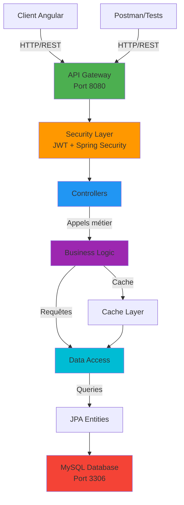
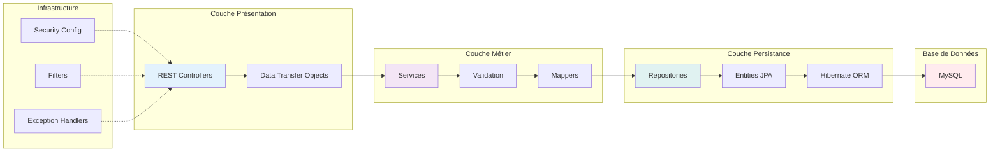
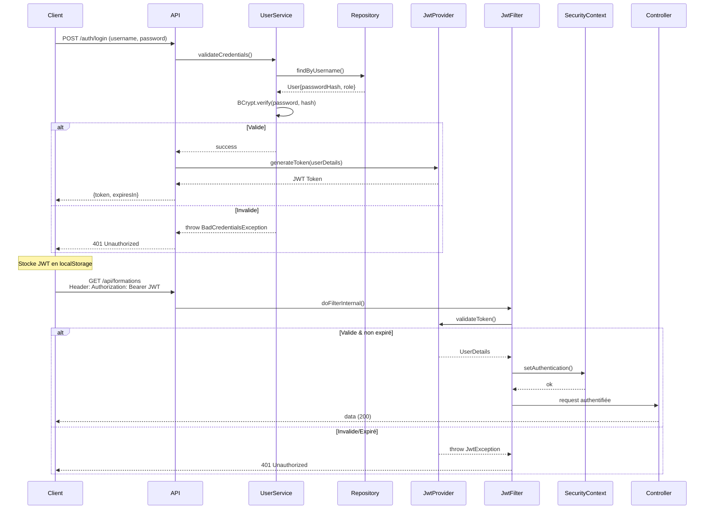

# Documentation Technique - LEYDYMEN Academy Platform

**Version**: 1.0.0  
**Date de rédaction**: 3 août 2026  
**Statut**: Production  

---

## Table des matières

1. [Vue d'ensemble de l'architecture](#vue-densemble-de-larchitecture)
2. [Configuration de l'environnement de développement](#configuration-de-lenvironnement-de-développement)
3. [Structure du projet backend](#structure-du-projet-backend)
4. [Modèle de données](#modèle-de-données)
5. [Architecture applicative](#architecture-applicative)
6. [Authentification et sécurité](#authentification-et-sécurité)
7. [Guide d'implémentation des services](#guide-dimplémentation-des-services)
8. [Endpoints API](#endpoints-api)
9. [Gestion des erreurs](#gestion-des-erreurs)
10. [Processus de déploiement](#processus-de-déploiement)
11. [Maintenance et monitoring](#maintenance-et-monitoring)

---

## 1. Vue d'ensemble de l'architecture

### 1.1 Présentation générale

LEYDYMEN Academy est une plateforme de gestion d'apprentissage (LMS) conçue pour administrer des bootcamps informatiques. L'architecture suit le pattern en couches avec une séparation claire des responsabilités:

- Couche présentation: API REST
- Couche métier: Services
- Couche persistance: Repositories et Entities
- Couche configuration: Sécurité et configuration Spring

### 1.2 Diagramme d'architecture global



### 1.3 Architecture en couches



### 1.2 Stack technique

- Framework: Spring Boot 3.x
- Langage: Java 17 ou supérieur
- Gestionnaire de dépendances: Maven 3.9+
- Base de données: MySQL 8.0+
- ORM: Spring Data JPA avec Hibernate
- Authentification: Spring Security 6.x avec JWT
- API Documentation: Springdoc OpenAPI 2.x
- Logging: SLF4J avec Logback

### 1.3 Principes architecturaux

- Separation of Concerns: Chaque couche dispose d'une responsabilité unique
- DRY (Don't Repeat Yourself): Réutilisation du code via les services
- SOLID Principles: Respect des principes d'architecture solide
- Transactional Integrity: Gestion des transactions pour la cohérence des données
- Security by Design: Sécurité intégrée dès la conception

---

## 2. Configuration de l'environnement de développement

### 2.1 Prérequis

- Docker 24.0+ et Docker Compose 2.20+
- Git
- Un IDE compatible (IntelliJ IDEA, Eclipse, VS Code)

### 2.2 Installation et démarrage rapide

#### Étape 1 : Récuperer le code

```bash
cd leydymen-academy
```

#### Étape 2 : Configurer les variables d'environnement

Créer un fichier `.env` à la racine du projet (copier depuis `.env.example`):

```bash
cp .env.example .env
```

Éditer le fichier `.env` avec vos paramètres spécifiques:

**Guide de configuration des variables:**

| Variable | Description | Valeur par défaut | Notes |
|----------|-------------|------------------|-------|
| `MYSQL_ROOT_PASSWORD` | Mot de passe root MySQL | `root_password` | À modifier en production |
| `MYSQL_DATABASE` | Nom de la base de données | `leydymen_db` | Créée automatiquement par Docker |
| `MYSQL_USER` | Utilisateur MySQL | `leydymen_user` | Créé automatiquement |
| `MYSQL_PASSWORD` | Mot de passe utilisateur MySQL | `leydymen_pass` | À modifier en production |
| `SPRING_PROFILES_ACTIVE` | Profil Spring Boot actif | `dev` | Options:  `dev`, `prod` |
| `APP_JWT_SECRET` | Clé secrète JWT | (Vide) | **OBLIGATOIRE** - Min 256 caractères |
| `APP_JWT_EXPIRATION_MS` | Durée de validité du token JWT | `86400000` | 24 heures = 24*60*60*1000 ms |
| `APP_JWT_REFRESH_EXPIRATION_MS` | Durée de validité du refresh token | `604800000` | 7 jours = 7*24*60*60*1000 ms |
| `LOGGING_LEVEL_ROOT` | Niveau de log général | `INFO` | DEBUG, INFO, WARN, ERROR |
| `LOGGING_LEVEL_COM_LEYDYMEN` | Niveau de log applicatif | `DEBUG` | DEBUG pour dev, INFO pour prod |
| `BACKEND_PORT` | Port du backend Spring Boot | `8080` | Adapter selon vos besoins |
| `MYSQL_PORT` | Port MySQL | `3306` | Adapter selon vos besoins |
| `PHPMYADMIN_PORT` | Port de phpMyAdmin | `8081` | Pour administration MySQL |

**Génération d'une clé secrète JWT:**

La clé `APP_JWT_SECRET` doit être cryptographiquement sécurisée. Utilisez l'une de ces commandes:

```bash
# Linux/Mac - OpenSSL
openssl rand -hex 128

# Linux/Mac - Python
python3 -c "import secrets; print(secrets.token_hex(128))"

# Alternative: 256 caractères alphanumériques
python3 -c "import string, secrets; print(''.join(secrets.choice(string.ascii_letters + string.digits) for _ in range(256)))"
```

Copiez le résultat dans `APP_JWT_SECRET` du fichier `.env`.

**Profiles Spring Boot:**

- `dev`: Utilisé en développement local (connexion MySQL via `localhost`)
- `prod`: Utilisé en production (optimisations, logging réduit)

#### Étape 3 : Lancer l'application avec Docker

```bash
# Démarrage des services
docker-compose up -d

# Vérifier le statut des services
docker-compose ps

# Consulter les logs en temps réel
docker-compose logs -f backend

# Logs spécifiques avec filtrage
docker-compose logs --tail=50 backend
```

L'application démarrera automatiquement sur `http://localhost:8080`

#### Étape 4 : Vérification du déploiement

```bash
# Vérifier que les services sont actifs
curl http://localhost:8080/swagger-ui.html

# Ou dans le navigateur, accéder à:
# - Backend API: http://localhost:8080
# - Swagger UI: http://localhost:8080/swagger-ui.html
# - phpMyAdmin: http://localhost:8081
```

### 2.3 Accès aux services

- **API Backend**: `http://localhost:8080`
- **Swagger UI**: `http://localhost:8080/swagger-ui.html`
- **OpenAPI JSON**: `http://localhost:8080/v3/api-docs`
- **phpMyAdmin**: `http://localhost:8081`
- **MySQL**: `localhost:3306` (user: `leydymen_user`, password: variable `MYSQL_PASSWORD` du `.env`)

### 2.4 Arrêt des services

```bash
# Arrêter les conteneurs (conserve les données)
docker-compose down

# Arrêter et supprimer les volumes (données supprimées)
docker-compose down -v

# Redémarrer les services
docker-compose restart

# Redémarrer un service spécifique
docker-compose restart backend
```

### 2.5 Développement avec Docker

Les modifications du code source effectuées dans votre IDE sont automatiquement reflétées dans le conteneur via les volumes Docker.

Pour forcer une reconstruction du conteneur après modifications majeures:
```bash
docker-compose up -d --build backend
```

Pour accéder au shell du conteneur backend:
```bash
docker-compose exec backend /bin/sh
```

Pour vérifier les variables d'environnement chargées:
```bash
docker-compose exec backend env | grep APP_JWT
```

---

## 3. Structure du projet backend

### 3.1 Organisation des répertoires

```
backend/
├── src/
│   ├── main/
│   │   ├── java/com/leydymen/app/
│   │   │   ├── controller/          # Contrôleurs REST
│   │   │   ├── service/             # Logique métier
│   │   │   ├── repository/          # Accès données
│   │   │   ├── entity/              # Entités JPA
│   │   │   ├── dto/                 # Objets de transfert
│   │   │   ├── exception/           # Exceptions personnalisées
│   │   │   ├── security/            # Configuration sécurité
│   │   │   ├── config/              # Configurations générales
│   │   │   ├── interceptor/         # Intercepteurs HTTP
│   │   │   └── util/                # Utilitaires
│   │   └── resources/
│   │       ├── application.yml
│   │       ├── application-dev.yml
│   │       ├── application-prod.yml
│   │       └── logback.xml
│   └── test/
│       └── java/com/leydymen/app/   # Tests unitaires et intégration
├── pom.xml                          # Configuration Maven
└── README.md                        # Documentation
```

### 3.2 Responsabilités des répertoires

**controller/**: Gère les requêtes HTTP et les réponses. Délègue la logique métier aux services.

**service/**: Contient la logique métier complexe. Orchestre les repositories et les transformations de données.

**repository/**: Interface avec la base de données via Spring Data JPA. Définit les requêtes personnalisées.

**entity/**: Représente les tables de la base de données. Contient les annotations JPA.

**dto/**: Objets pour le transfert de données entre couches. Séparation entre entités et API.

**security/**: Configuration Spring Security, JWT Provider, filtres d'authentification.

**config/**: Configurations générales (CORS, Bean customisés, etc.).

---

## 4. Modèle de données

### 4.1 Diagramme des entités

```
USER
├── id: Long (PK)
├── username: String (UNIQUE)
├── email: String (UNIQUE)
├── password: String (hasté)
├── firstName: String
├── lastName: String
├── role: Enum (ADMIN, INSTRUCTOR, STUDENT)
├── status: Enum (ACTIVE, INACTIVE, BANNED)
└── Relations:
    ├── 1:N FORMATION (instructeur)
    ├── 1:N ENROLLMENT (étudiant)
    └── 1:N STUDENT_PROGRESS

FORMATION
├── id: Long (PK)
├── title: String
├── description: String
├── category: String
├── level: Enum (BEGINNER, INTERMEDIATE, ADVANCED)
├── duration: Integer (heures)
├── price: BigDecimal
├── status: Enum (DRAFT, PUBLISHED, ONGOING, COMPLETED, CANCELLED)
├── instructor_id: Long (FK)
└── Relations:
    ├── 1:N MODULE
    └── 1:N ENROLLMENT

MODULE
├── id: Long (PK)
├── formation_id: Long (FK)
├── title: String
├── description: String
├── order: Integer
├── status: Enum
└── Relations:
    └── 1:N LESSON

LESSON
├── id: Long (PK)
├── module_id: Long (FK)
├── title: String
├── content: String
├── videoUrl: String
├── duration: Integer (minutes)
├── order: Integer
└── Relations:
    └── 1:N STUDENT_PROGRESS

ENROLLMENT
├── id: Long (PK)
├── student_id: Long (FK)
├── formation_id: Long (FK)
├── enrollmentDate: LocalDate
├── status: Enum (PENDING, ACTIVE, COMPLETED, CANCELLED)
├── completionPercentage: Float
├── UNIQUE(student_id, formation_id)
└── Relations:
    └── 1:N STUDENT_PROGRESS

STUDENT_PROGRESS
├── id: Long (PK)
├── student_id: Long (FK)
├── lesson_id: Long (FK)
├── enrollment_id: Long (FK)
├── status: Enum (NOT_STARTED, IN_PROGRESS, COMPLETED)
├── percentageWatched: Float
├── UNIQUE(student_id, lesson_id)
```

### 4.2 Contraintes d'intégrité

- Unicité des usernames et emails
- Unicité des paires (student_id, formation_id) dans les enrollments
- Unicité des paires (student_id, lesson_id) dans les progress
- Cascade delete pour les relations parent-enfant
- NOT NULL sur les champs obligatoires

---

## 5. Architecture applicative

### 5.1 Pattern Couches

L'application suit une architecture en couches avec flux unidirectionnel:

```
HTTP Request
    ↓
Controller (Validation des paramètres)
    ↓
Service (Logique métier, transactions)
    ↓
Repository (Requêtes database)
    ↓
Database
    ↓
Repository (Résultat)
    ↓
Service (Transformation DTO)
    ↓
Controller (Réponse HTTP)
    ↓
HTTP Response
```

### 5.2 Flux de requête typique

1. Requête HTTP arrive au contrôleur
2. Validations préalables (@Valid, permissions)
3. Extraction de l'utilisateur courant via SecurityService
4. Appel du service approprié
5. Service exécute logique métier
6. Repository interroge la base de données
7. Résultats transformés en DTO
8. Réponse ApiResponse wrapper envoyée au client

---

## 6. Authentification et sécurité

### 6.1 Flux d'authentification JWT



### 6.2 Configuration de sécurité

Les endpoints sont protégés via annotations @PreAuthorize:

```java
@PreAuthorize("hasRole('ADMIN')")                    // Admins uniquement
@PreAuthorize("hasRole('INSTRUCTOR')")               // Instructeurs uniquement
@PreAuthorize("hasRole('STUDENT')")                  // Étudiants uniquement
@PreAuthorize("hasRole('ADMIN') or hasRole('INSTRUCTOR')")  // Multiple rôles
```

### 6.3 Extraction de l'utilisateur courant

Via SecurityService:

```java
Long userId = securityService.getCurrentUserId();
String username = securityService.getCurrentUsername();
boolean isCurrentUser = securityService.isCurrentUser(userId);
```

### 6.4 Gestion des tokens

- Secret: Clé cryptographique de 256 caractères minimum
- Expiration: 86400000 ms (24 heures)
- Refresh Expiration: 604800000 ms (7 jours)
- Algorithme: HS256 (HMAC with SHA-256)

### 6.5 Best practices sécurité

- Mots de passe hashés avec BCrypt (strength 12)
- Tokens jamais stockés côté serveur
- Refresh tokens pour renouvellement sûr
- CORS configuré pour domaines autorisés
- Headers sécurité HTTP appliqués
- Validations input strictes

---

---

## 7. Endpoints API

### 7.1 Convention de nommage

- Ressources au pluriel: `/api/formations`, `/api/users`
- Identifiants dans le chemin: `GET /api/formations/{id}`
- Actions comme query params: `GET /api/formations?status=PUBLISHED`
- Collections avec pagination: `?page=0&size=10`

### 7.2 Format de réponse

Toutes les réponses suivent le format ApiResponse:

```json
{
  "status": 200,
  "message": "Success message",
  "data": { /* payload */ },
  "timestamp": "2026-08-03T17:30:54.560413975"
}
```

### 7.3 Codes HTTP

- 200 OK: Succès pour GET, PUT
- 201 Created: Succès pour POST
- 204 No Content: Succès pour DELETE
- 400 Bad Request: Validation échouée
- 401 Unauthorized: Authentification requise
- 403 Forbidden: Permissions insuffisantes
- 404 Not Found: Ressource inexistante
- 409 Conflict: Conflit (doublon, etc.)
- 500 Internal Server Error: Erreur serveur

### 7.4 Pagination

Format de réponse paginée:

```json
{
  "content": [ /* items */ ],
  "totalElements": 100,
  "totalPages": 10,
  "currentPage": 0,
  "pageSize": 10
}
```

Paramètres:
- page: Numéro de page (0-indexed)
- size: Nombre d'éléments par page (max 100)

---

## 8. Gestion des erreurs

### 8.1 Hiérarchie des exceptions

```
RuntimeException
├── ResourceNotFoundException
├── UnauthorizedAccessException
├── InvalidOperationException
└── ValidationException
```

### 8.2 Logging des erreurs

```java
log.error("Erreur critique lors de la création d'une formation: {}", ex.getMessage(), ex);
log.warn("Tentative d'accès non autorisé à la ressource: {}", userId);
log.info("Formation {} créée avec succès", formationId);
```

### 8.3 Réponse d'erreur

```json
{
  "status": 400,
  "message": "Erreur de validation",
  "errors": [
    {
      "field": "email",
      "message": "Email invalide"
    }
  ],
  "timestamp": "2026-08-03T17:30:54.560413975"
}
```

---

## 9. Déploiement et configuration

### 9.1 Déploiement avec Docker


```bash
# Démarrer l'environnement complet (backend + MySQL)
docker-compose up -d

# Vérifier les services
docker-compose ps

# Voir les logs
docker-compose logs -f backend
```

### 9.2 Architecture Docker

L'application utilise Docker Compose avec trois services:

**MySQL (Base de données)**
- Image: mysql:8.0
- Port: 3306
- Volume: mysql_data (persistance)
- Healthcheck: Vérifie la disponibilité

**Backend (API Spring Boot)**
- Build: Multi-stage (Maven builder + JRE runtime)
- Port: 8080
- Dépendances: MySQL (avec healthcheck)
- Profile: prod

**phpMyAdmin (Gestion BD - optionnel)**
- Image: phpmyadmin:latest
- Port: 8081
- Accès: user=leydymen_user, pass=user_password

### 9.3 Fichiers de configuration Docker

**docker-compose.yml** - Fichier principal avec les trois services

**Dockerfile** - Build multi-stage pour le backend

**.dockerignore** - Fichiers ignorés lors du build

### 9.4 Commandes courantes

```bash
# Démarrage
docker-compose up -d

# Arrêt
docker-compose down

# Arrêt avec suppression des volumes
docker-compose down -v

# Redémarrage d'un service
docker-compose restart backend

# Rebuild du backend
docker-compose up -d --build backend

# Consulter les logs
docker-compose logs -f backend

# Accès au shell
docker-compose exec backend /bin/sh
```

### 9.5 Accès à MySQL depuis l'IDE

Configuration de connexion dans l'IDE:
- Host: localhost
- Port: 3306
- Username: leydymen_user
- Password: user_password
- Database: leydymen_db

### 9.6 Dépannage Docker

**Service ne démarre pas:**
```bash
docker-compose logs backend
docker-compose down
docker-compose up -d --build
```

**Port déjà utilisé:**
```bash
# Trouver le processus
lsof -i :8080

# Arrêter les conteneurs
docker-compose down
```

**Erreur de connexion MySQL:**
```bash
# Vérifier la santé MySQL
docker-compose exec mysql mysqladmin ping

# Redémarrer MySQL
docker-compose restart mysql
```

---

## 10. Maintenance et monitoring

### 10.1 Gestion des conteneurs Docker

**Redémarrage:**
```bash
# Redémarrer un service
docker-compose restart backend

# Redémarrer tous les services
docker-compose restart
```

**Vérification de l'état:**
```bash
docker-compose ps
docker-compose logs -f backend
docker stats leydymen-backend
```

**Nettoyage:**
```bash
# Supprimer les conteneurs arrêtés
docker-compose down

# Supprimer les volumes (données perdues)
docker-compose down -v

# Purger l'espace inutilisé
docker system prune -a
```

### 10.2 Backup de la base de données

```bash
# Backup via Docker
docker-compose exec mysql mysqldump -u leydymen_user -puser_password leydymen_db > backup-$(date +%Y%m%d).sql

# Restauration
docker-compose exec -T mysql mysql -u leydymen_user -puser_password leydymen_db < backup-20260803.sql
```

### 10.3 Logs applicatifs

```bash
# Voir tous les logs
docker-compose logs

# Logs en temps réel
docker-compose logs -f

# Logs d'un service spécifique
docker-compose logs backend

# Logs des 100 dernières lignes
docker-compose logs --tail 100 backend
```

### 10.4 Accès à la base de données

```bash
# Via Docker
docker-compose exec mysql mysql -u leydymen_user -puser_password leydymen_db

# Exemple de requête
mysql> SELECT * FROM user;
mysql> SHOW TABLES;
mysql> EXIT;
```

### 10.5 Performance et ressources

```bash
# Statistiques en temps réel
docker stats

# Limiter les ressources dans docker-compose.yml
services:
  backend:
    deploy:
      resources:
        limits:
          cpus: '1'
          memory: 1024M
```

### 10.6 Dépannage courant

**L'application ne démarre pas:**
```bash
docker-compose logs backend
docker-compose down
docker-compose up -d --build
```

**Erreur MySQL:**
```bash
docker-compose exec mysql mysqladmin ping
docker-compose restart mysql
```

**Connectivité réseau:**
```bash
# Inspecter le réseau Docker
docker network ls
docker network inspect leydymen-network

# Tester la connexion
docker-compose exec backend ping mysql
```

**Port déjà utilisé:**
```bash
lsof -i :8080
docker-compose down
docker-compose up -d
```

---

## Conclusion

Cette documentation fournit les bases pour comprendre et maintenir la plateforme LEYDYMEN Academy. Pour toute question ou clarification supplémentaire, consulter le code source annoté.